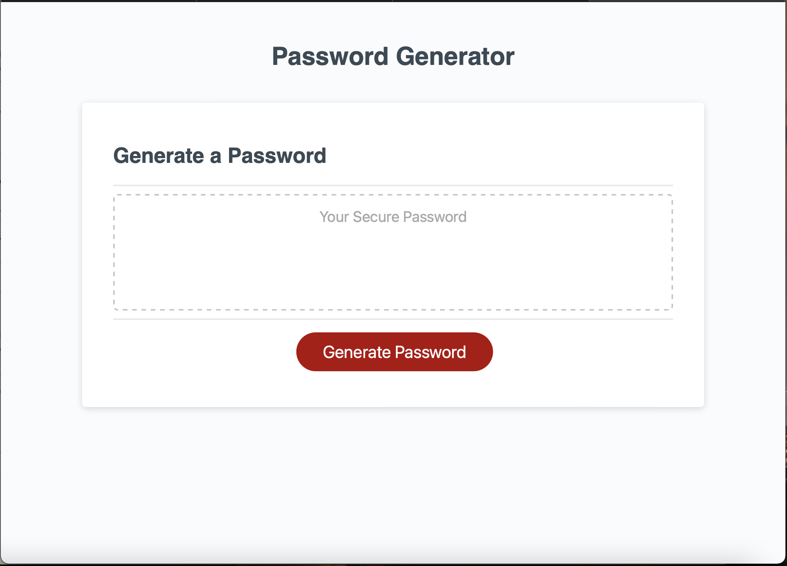
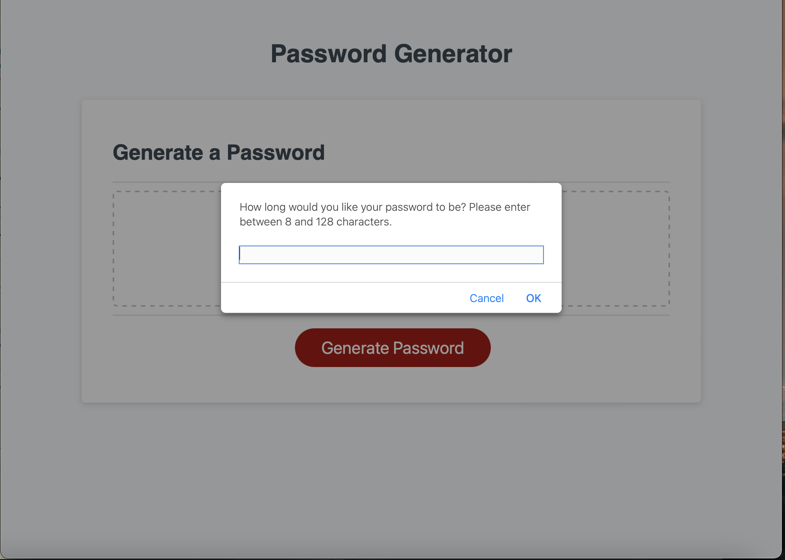

# Password Generator 

# Description 
This repository encapsulates code created to generate a random password between 8 and 128 characters , including special characters to increase the safety of every password.

# Screenshot of webpage
 

# Screenshot of webpage in use
 

# Webpage Link 
https://carternadain.github.io/Password-Generator-project-/

# Repository Link
https://github.com/carternadain/Password-Generator-project-